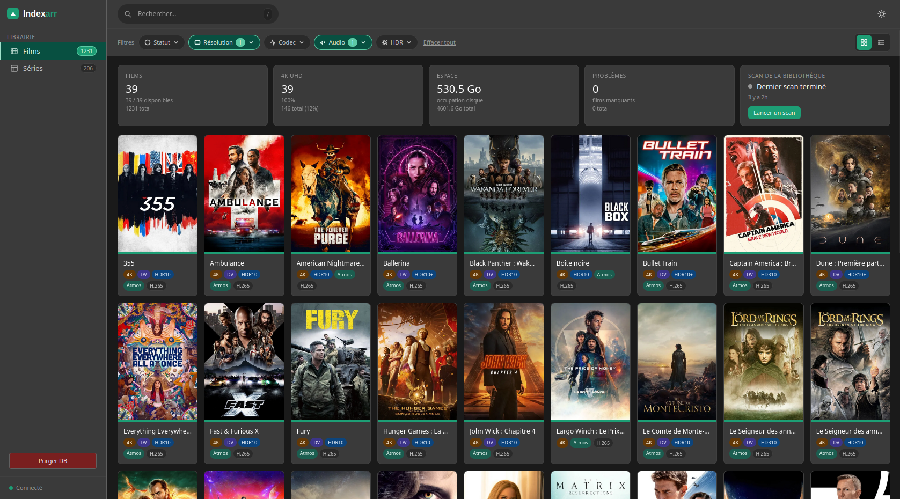

# Indexarr (Mediarr)

Indexarr is a media library management application inspired by Sonarr and Radarr. It provides centralized catalog management for movies and TV series with detailed tracking of media file properties, library statistics, and advanced filtering.

> [!WARNING]
> **Disclaimer:** This software is provided as-is, without any warranty. Use at your own risk. The authors and contributors are not responsible for any data loss, damage, or issues resulting from the use of this application.
>
> **Note:** This application has been developed with intensive help from AI coding agents (including GitHub Copilot and similar tools).




## Features
- Centralized movie and TV series catalog
- Advanced multi-criteria filtering (status, resolution, codec, audio, HDR)
- Real-time statistics (total count, disk space, 4K %, problems)
- Detailed media info (video/audio/subtitle tracks)
- Responsive UI with grid/list views
- RESTful API backend

## Project Structure

```
indexarr/
├── AGENTS.md                # Chat customization guide
├── LICENSE                  # GPL v3
├── backend/                 # Go backend
│   └── go/
│       ├── cmd/server/      # Entry point
│       ├── internal/
│       │   ├── api/         # HTTP handlers
│       │   ├── config/      # Configuration
│       │   ├── models/      # Data models
│       │   ├── repository/  # Database layer
│       │   └── services/    # Business logic
│       ├── go.mod           # Go module
│       └── README.md        # Backend docs
├── frontend/                # React frontend
│   └── react/
│       ├── src/
│       │   ├── components/  # UI components
│       │   ├── pages/       # Page components
│       │   ├── api/         # API client
│       │   ├── hooks/       # Custom hooks
│       │   ├── styles/      # CSS modules
│       │   ├── types/       # TypeScript types
│       │   └── App.tsx      # Root component
│       ├── package.json     # Dependencies
│       └── README.md        # Frontend docs
├── ux-ui/                   # UI/UX design
│   ├── medialib_v4_detail_pages.html  # Full HTML/CSS mockup
│   └── prompt.md            # Implementation specs
```

## Getting Started

### Quick Start installation

The easiest and recommended way to run Indexarr is with Docker Compose. The provided `docker-compose.yml` is production-ready with automatic restarts, data persistence, and proper networking.

#### Prerequisites
- Docker and Docker Compose installed
- TMDB and TVDB API keys (optional, but recommended for full metadata)


#### Installation Steps

1. **Create docker-compose file:**

   Download or copy content from https://github.com/pschmucker/indexarr/blob/main/docker-compose.yml
   
2. **Configure environment variables:**
   
   Download or copy content from https://github.com/pschmucker/indexarr/blob/main/.env.example

   Create a `.env` file with your configuration:
   ```bash
   cp .env.example .env
   # Edit .env with your TMDB/TVDB API keys and media library paths
   ```

3. **Start the application:**
   ```bash
   docker compose up -d
   ```
   
   This will:
   - Pull the latest image from GitHub Container Registry
   - Create a persistent volume for application data
   - Mount your media libraries (read-only)
   - Start the service with automatic restart on failure

4. **Verify it's running:**
   ```bash
   docker compose ps
   docker compose logs -f
   ```

5. **Access the application:**
   - **Frontend:** http://localhost:8787
   - **API:** http://localhost:8787/api
   - **Health check:** http://localhost:8787/health

#### Configuration Reference

| Variable | Default | Required | Description |
|----------|---------|----------|-------------|
| `TMDB_API_KEY` | - | No | TMDB API key for movie metadata ([get here](https://www.themoviedb.org/settings/api)) |
| `TVDB_API_KEY` | - | No | TVDB API key for tv-shows metadata ([get here](https://www.thetvdb.com/api-information)) |
| `MOVIES_PATH` | - | Yes | Comma-separated paths to movies folder on the host (e.g., `/movies` or `/mnt/nas/movies,/external/movies`) |
| `TV_SHOWS_PATH` | - | Yes | Comma-separated paths to tv-shows folder on the host (e.g., `/tv-shows` or `/mnt/nas/tv,/external/tv`) |
| `MEDIA_LIBRARY_PATHS` | /data/movies,/data/tv-shows | No | Comma-separated paths to media on the guest |
| `RADARR_URL` | http://radarr:7878 | No | Radarr URL |
| `SONARR_URL` | http://sonarr:8989 | No | Sonarr URL |
| `SCAN_INTERVAL` | 24 | No | Library scan interval in hours |
| `SCAN_TIMEOUT` | 30 | No | Scan timeout in minutes |
| `TZ` | UTC | No | Timezone (e.g., `Europe/Paris`, `America/New_York`) |
| `UID` | 1000 | No | User ID inside container (match your media library owner) |
| `GID` | 1000 | No | Group ID inside container (match your media library owner) |

#### Media Permissions Setup

Indexarr runs as a non-root user inside the container for security. By default, it uses UID 1000 and GID 1000. **If your media library is owned by a different user** (e.g., Radarr, Sonarr, or another service), you must configure `UID` and `GID` to match the owner, or the container won't be able to read your files.

**Why this matters:**
- Indexarr reads media files from mounted volumes (read-only)
- If the container user doesn't have read permission on these files, scans will fail

**How to fix it:**

1. **Find your media library owner:**
   ```bash
   # Check media library ownership
   ls -ld /mnt/media/movies
   # Example output: drwxr-x--- 1220 radarr media-center 77824 May  6 movies
   
   # Get UID and GID of the owner
   id radarr
   # Example output: uid=1041(radarr) gid=100(users) groups=100(users),65541(media-center)
   ```

2. **Update `.env` file:**
   ```bash
   # For Radarr (UID 1041, GID 65541)
   UID=1041
   GID=65541
   
   # Or for Sonarr (UID 1042, GID 65541)
   UID=1042
   GID=65541
   ```

3. **Rebuild and restart (dev setup):**
   ```bash
   # With docker-compose.dev.yml (local build)
   docker compose -f docker-compose.dev.yml build --no-cache
   docker compose -f docker-compose.dev.yml up -d
   ```

4. **Or restart with pre-built image (production):**
   ```bash
   # With docker-compose.yml (pre-built image)
   # Just restart - env vars apply at runtime
   docker compose up -d
   ```

5. **Verify permissions are working:**
   ```bash
   # Check if app is running as correct user
   docker exec indexarr id
   # Should show: uid=1041(appuser) gid=65541(media-center)
   
   # Check if media files are readable
   docker exec indexarr ls -la /data/movies/
   # Should show files, not permission denied errors
   ```

**Note on local builds:**
- When building locally with `docker-compose.dev.yml`, build args set the initial file ownership at build time
- At runtime, the container adjusts file ownership to match `UID` and `GID`
- With pre-built images from ghcr.io, only the runtime environment variables matter

#### Common Operations

**View logs in real-time:**
```bash
docker compose logs -f
```

**Stop the application:**
```bash
docker compose down
```

**Stop and remove all data:**
```bash
docker compose down -v
```

**Restart the application:**
```bash
docker compose restart
```

**Update to latest version:**
```bash
docker compose pull
docker compose up -d
```

#### Using Pre-built Image from GitHub Container Registry

```bash
docker pull ghcr.io/pschmucker/indexarr:latest
docker run -d -p 8787:8787 \
      -v indexarr_data:/app/data \
      -v /mnt/movies:/data/movies \
      -v /mnt/tv-shows:/data/tv-shows \
      -e TMDB_API_KEY=fffffffffffffffff \
      -e TVDB_API_KEY=fffffffffffffffff \
      -e RADARR_URL=http://radarr:7878 \
      -e SONARR_URL=http://sonarr:8989 \
      ghcr.io/pschmucker/indexarr:latest
```

### Manual Development Setup

#### Prerequisites
- Node.js (>=18)
- Go (>=1.21)
- mediainfo CLI

#### Backend Setup
1. Navigate to backend:
   ```bash
   cd backend/go
   ```
2. Install dependencies:
   ```bash
   go mod download && go mod tidy
   ```
3. Create `.env` file from example:
   ```bash
   cp .env.example .env
   # Edit .env with your configuration
   ```
4. Run the server:
   ```bash
   go run ./cmd/server
   ```
5. Run tests:
   ```bash
   go test ./...
   ```

#### Frontend Setup
1. Navigate to frontend:
   ```bash
   cd frontend/react
   ```
2. Install dependencies:
   ```bash
   npm install
   ```
3. Start development server:
   ```bash
   npm run dev
   ```
4. Run tests:
   ```bash
   npm test
   ```

### Building Docker Image Locally

```bash
# Build the image
docker build -t indexarr:latest .

# Run the container
docker run -d -p 80:80 -v indexarr_data:/app/data indexarr:latest
```

## Design & Implementation
- **Design system:** See `ux-ui/medialib_v4_detail_pages.html` for full mockups and CSS variables.
- **Implementation guide:** See `ux-ui/prompt.md` for detailed frontend specs.
- **Chat agent customization:** See `AGENTS.md` for agent and workflow details.

## License
GPL v3 — see [LICENSE](LICENSE)

---

For more details, see the [backend README](backend/go/README.md) and [frontend README](frontend/react/README.md).
