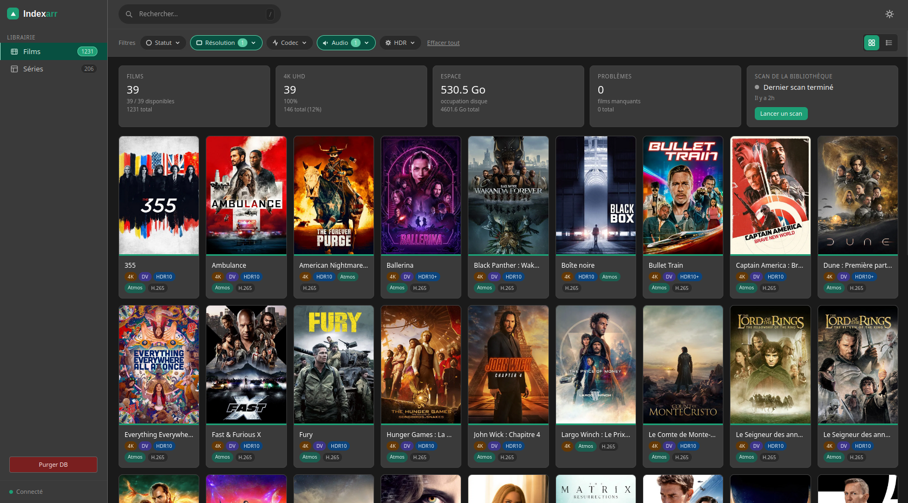

# Indexarr

**Indexarr** is a media library application inspired by [Sonarr](https://sonarr.tv/) and [Radarr](https://radarr.video/). It provides a centralized catalog for movies and series with detailed tracking of media file properties, library statistics, and advanced filtering capabilities.




## Table of contents

- [Features](#features)
- [Getting started](#getting-started)
  - [Prerequisites](#prerequisites)
  - [Installation](#installation)
- [Configuration reference](#configuration-reference)
- [Development setup](#development-setup)
  - [Prerequisites](#prerequisites-1)
  - [Backend setup](#backend-setup)
  - [Frontend setup](#frontend-setup)
  - [Building Docker image locally](#building-docker-image-locally)
- [Common issues](#common-issues)
  - [Incorrect matching](#incorrect-matching)
  - [Media permissions](#media-permissions)
  - [Extra files](#extra-files)
- [License](#license)


## Features

- **Centralized movies and series catalog**
  - **Radarr / Sonarr integrations** — Import from existing Radarr / Sonarr libraries
  - **Filesystem scanning** — Discover media from local directories
  - **Blu-ray formats support** — Uncompressed folder and ISO files
- **Accurate media intelligence**
  - **Detailed media info detection** — video, audio, and subtitle tracks
  - **Multi-criteria filtering** — title, year, status, resolution, codec, audio, HDR
  - **Real-time statistics** — total count, disk space, 4K %, problem counts
- **Easy user experience**
  - **Multi-language support** — English, Français, Español, Italiano, Deutsch
  - **Responsive UI** — Supports desktop, tablet, and mobile devices
  - **User authentication** — Builtin authentication with local users


## Getting started

The easiest and recommended way to run Indexarr is with Docker Compose. The provided [docker-compose.yml](docker-compose.yml) is production-ready with automatic restarts, data persistence, and proper networking.


### Prerequisites
- [Docker](https://docs.docker.com/engine/install/) installed
- [TMDB](https://www.themoviedb.org/settings/api) and [TVDB](https://www.thetvdb.com/api-information) API keys (optional, but highly recommended for full metadata)


### Installation

1. **Create docker-compose file:**

   Download or copy content from [docker-compose.yml](docker-compose.yml)
   
2. **Configure environment variables:**
   
   Download or copy content from [.env.example](.env.example)

   Create a `.env` file with your configuration:
   ```bash
   cp .env.example .env
   # Edit .env with your TMDB/TVDB API keys and media library paths
   ```

3. **Start the application:**
   ```bash
   docker compose up -d
   ```
   
   This will:
   - Pull the latest image from GitHub Container Registry
   - Create a persistent volume for application data
   - Mount your media libraries (read-only)
   - Start the service with automatic restart on failure

4. **Verify it's running:**
   ```bash
   docker compose ps
   docker compose logs -f
   ```

5. **Access the application:**
   - **Frontend:** http://localhost:8787
   - **Health check:** http://localhost:8787/health


## Configuration reference

| Variable | Default | Required | Description |
|----------|---------|----------|-------------|
| `MOVIES_HOST_PATH` | - | Yes | Comma-separated paths to movies folders on the host for volume mount (e.g., `/movies` or `/mnt/nas/movies,/external/movies`) |
| `SERIES_HOST_PATH` | - | Yes | Comma-separated paths to series folders on the host for volume mount (e.g., `/series` or `/mnt/nas/tv,/external/tv`) |
| `MEDIA_LIBRARY_PATHS` | /data/movies,/data/series | No | Comma-separated paths to media on the guest [**Deprecated**: use `MOVIES_LIBRARY_PATHS` and `SERIES_LIBRARY_PATHS` instead] |
| `MOVIES_LIBRARY_PATHS` | /data/movies | No | Comma-separated paths to movies on the guest |
| `SERIES_LIBRARY_PATHS` | /data/series | No | Comma-separated paths to series on the guest |
| `SKIP_FOLDERS` | - | No | Comma-separated list of folders to skip during scanning |
| `IGNORE_FILE_PATTERN` | - | No | Regular expression pattern to ignore matching files during scanning |
| `TMDB_API_KEY` | - | No, but recommended | TMDB API key for movie metadata ([get here](https://www.themoviedb.org/settings/api)) |
| `TVDB_API_KEY` | - | No, but recommended | TVDB API key for series metadata ([get here](https://www.thetvdb.com/api-information)) |
| `RADARR_URL` | http://radarr:7878 | No | Radarr URL |
| `RADARR_API_KEY` | - | No | Radarr API key for importing movies from Radarr |
| `RADARR_PATH_MAPPING` | - | No | Used to map Radarr paths to local paths (e.g. `/movies:/data/movies`) |
| `SONARR_URL` | http://sonarr:8989 | No | Sonarr URL |
| `SONARR_API_KEY` | - | No | Sonarr API key for importing series from Sonarr |
| `SONARR_PATH_MAPPING` | - | No | Used to map Sonarr paths to local paths (e.g. `/series:/data/series`) |
| `DETECTION_LANGUAGE` | en | No | Language code for media detection (e.g., "en", "fr") |
| `METADATA_LANGUAGE` | en | No | Language code for metadata fetching (e.g., "en", "fr") |
| `SCAN_INTERVAL` | 24 | No | Library scan interval in hours |
| `SCAN_TIMEOUT` | 30 | No | Timeout in seconds for media info extraction during scan |
| `AUTH_MODE` | `none` | No | Authentication mode (`none` or `simple`) |
| `AUTH_ADMIN_USERNAME` | - | Yes if `AUTH_MODE` is `simple` | Username of administrator account |
| `AUTH_ADMIN_PASSWORD` | - | Yes if `AUTH_MODE` is `simple` | Password of administrator account |
| `AUTH_SESSION_SECRET` | - | No | A random secret (auto-generated if not provided) |
| `AUTH_SESSION_MAX_AGE` | 168 | No | Maximum session validity (default to 168 hours, ie. 7 days) |
| `LOG_LEVEL` | `INFO` | No | Logging level (`TRACE`, `DEBUG`, `INFO`, `WARN`, `ERROR`) |
| `UID` | 1000 | No | User ID inside container (match your media library owner) |
| `GID` | 1000 | No | Group ID inside container (match your media library owner) |
| `TZ` | UTC | No | Timezone (e.g., `Europe/Paris`, `America/New_York`) |


## Development setup

### Prerequisites
- Node.js (>=24)
- Go (>=1.25)
- mediainfo CLI (for video file analysis)


### Backend setup
1. Navigate to backend:
   ```bash
   cd backend/go
   ```
2. Install dependencies:
   ```bash
   go mod download && go mod tidy
   ```
3. Create `.env` file from example:
   ```bash
   cp .env.example .env
   # Edit .env with your configuration
   ```
4. Run the server:
   ```bash
   go run ./cmd/server
   ```
5. Run tests:
   ```bash
   go test ./...
   ```


### Frontend setup
1. Navigate to frontend:
   ```bash
   cd frontend/react
   ```
2. Install dependencies:
   ```bash
   npm install
   ```
3. Start development server:
   ```bash
   npm run dev
   ```
4. Run tests:
   ```bash
   npm test
   ```


### Run Docker image locally
1. Create `.env` file from example:
   ```bash
   cp .env.example .env
   # Edit .env with your configuration
   ```
2. Run dev compose file:
   ```bash
   docker compose -f docker-compose.dev.yml up -d
   ```


## Common issues

### Incorrect matching

If your media files are not correctly detected (no poster, duration, wrong links, etc...), review the files and folders naming with the following recommendations:
- **Movies**: file must be in a folder named `{movie title} ({year})`
- **Series**: each series must have a folder named `{series name} ({year})`
- **Episodes**: file must contain the season and episode number with a standard pattern like `S01E05` or `1x05`

If the files and folders naming are correct but still have incorrect matches, check whether the title and year are correct on [TheMovieDB](https://www.themoviedb.org/).


### Media permissions

Indexarr runs as a non-root user inside the container for security. By default, it uses UID 1000 and GID 1000. **If your media library is owned by a different user** (e.g., Radarr, Sonarr, or another service), you must configure `UID` and `GID` to match the owner, or the container won't be able to read your files.

**Why this matters:**
- Indexarr reads media files from mounted volumes (read-only)
- If the container user doesn't have read permission on these files, scans will fail

**How to fix it:**

1. **Find your media library owner:**
   ```bash
   # Check media library ownership
   ls -ld /mnt/media/movies
   # Example output: drwxr-x--- 1220 radarr media-center 77824 May  6 movies
   
   # Get UID and GID of the owner
   id radarr
   # Example output: uid=1041(radarr) gid=100(users) groups=100(users),65541(media-center)
   ```

2. **Override `UID` and `GID` environment variables:**
   ```yaml
   environment:
     UID: 1041
     GID: 65541
   ```

3. **Restart application:**
   ```bash
   # With docker-compose.yml (pre-built image)
   docker compose up -d
   ```

4. **Verify permissions are working:**
   ```bash
   # Check if app is running as correct user
   docker exec indexarr id
   # Should show: uid=1041(appuser) gid=65541(media-center)
   
   # Check if media files are readable
   docker exec indexarr ls -la /data/movies/
   # Should show files, not permission denied errors
   ```

**Note on local builds:**
- When building locally with `docker-compose.dev.yml`, build args set the initial file ownership at build time
- At runtime, the container adjusts file ownership to match `UID` and `GID`
- With pre-built images from ghcr.io, only the runtime environment variables matter


### Extra files

Extra files such as **Behind the scenes**, **interviews**, **trailers**, etc... will likely be incorrectly matched. To avoid that, you can exclude some folders from scanning by setting the `SKIP_FOLDERS` environment variable:

```yaml
environment:
  # Skip the folders based on Plex extras list:
  # https://support.plex.tv/articles/local-files-for-trailers-and-extras/
  SKIP_FOLDERS: Behind The Scenes, Deleted Scenes, Featurettes, Interviews, Scenes, Shorts, Trailers, Other
```

If you need a more advanced way to exclude only some files, you can set the `IGNORE_FILE_PATTERN` environment variable instead and define
the regular expression you want:

```yaml
environment:
  # Ignore all AVI files
  IGNORE_FILE_PATTERN: "\.avi$"
```


## License
GPL v3 — see [LICENSE](LICENSE)

---

For more details, see the [backend README](backend/go/README.md) and [frontend README](frontend/react/README.md).
